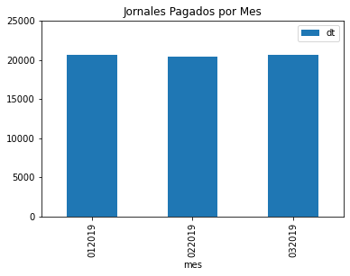

# BPS_Reporting

Todas las empresas uruguayas deben remitir mensualmente la información de los salarios pagados al Banco de Previsión Social (BPS). Ésto se realiza a través de un formato y una codificación específica, y por lo general es cumplimentado por estudios tercerizados o un departamento especializado dentro de la empresa.

Nuestra intención con este desarrollo es lograr automatizar un reporting independiente de los estudios o de los departamentos especializados. Algunos aspectos que nos motivan son:
* Uniformidad: Ya que todas las declaraciones nominadas para industria y comercio comparten formato y codificación, este desarrollo puede ser aplicado en cualquiera de ellas independientemente de su estructura informática, el software utilizado o la calidad de sus archivos.
* Eficiencia: Los equipos de RH, payroll o similares suelen tener que compilar información y estructurarla a las necesidades de análisis de las gerencias, cuando no están especializados en ello.
* Control: Para los casos en los que ya se cuente con procedimientos de reporting, este proceso automático le puede devolver algunos datos sobre cuales controlar si las retribuciones al personal y contribuciones a la seguridad social se han realizado y registrado de forma correcta.

Los archivos utilizados en el ejemplo son nóminas reales donde, a efectos de conservar la privacidad de la empresa, se modificaron los datos como el número de contribuyente, RUC, cédulas y nombres.

[Puedes acceder al notebook aquí](https://github.com/GregorioMorena/BPS_Reporting/blob/main/f_bps.ipynb)

## Requisitos

Para este código necesitamos tener instalados:

```
*Python 3
*Numpy
*Pandas
*Matplotlib
```

## Importando los archivos txt con la declaración nominada

Esta función lee los datos desde un archivo o una lista de archivos que deseamos analizar, y lo convierte en información legible.

Por ejemplo, si usamos las declaraciones nominadas del primer trimestre de 2019 guardadas en el directorio:

```
N_1_7301273_202001.txt
N_1_7301273_202002.txt
N_1_7301273_202003.txt
```

Podemos importar sólo una, un par de ellas, o todas a la vez. En este caso vamos a importar todas.

### Primer paso

Al no contar con un formato legible para la librería Pandas, el código modifica el texto de cada archivo para poder ser procesado.
Esto va a provocar que estos archivos sean legibles para la librería Pandas, pero aun no para nosotros.

### Segundo paso

Importación de los archivos con la librería Pandas. La información no es legible aun, pero podemos manipularla para que resulte en una tabla sencilla con la información que seleccionemos como relevante.


Podríamos además agregar más información utilizando los registros existentes, por ejemplo:

* Subtotales de un período determinado por persona
* Si una persona tiene menores a cargo
* Cuánto contribuye a la seguridad social y cuánto tributa de IRPF

En este ejemplo, sólo conservaremos los datos originales.

### Tercer paso

Se chequea si la importación se realiza correctamente mediante con cotejo de los montos totales de cada archivo con el total de las observaciones en la tabla. A su vez, se puede presentar un reporte que muestre algunos de los datos principales.




## Conclusiones

Este desarrollo automatiza un análisis de los costos del personal basados sólamente en la información contenida en la seguridad social uruguaya (BPS). Incluso se podría etraer más información sobre vacaciones, rotación, impuestos, cargas sociales, etc.

Para agregar más valor a este desarrollo, se puede complementar con información extraída de otras fuentes como pueden ser:

* Planilla de Trabajo: Nos daría información sobre salario pactado de cada persona, el horario, los descansos y la forma de retribución.
* Convenios colectivos: En los convenios y sus sucesivas actas se detallan aumentos, partidas varias e información variada que podría resultar útil según el análisis deseado.
* Información ya existente en la empresa: Cualquier registro sobre el personal o cualquier otro aspecto que se quiera agregar a los reportes como por ejemplo: marcas de entrada y salida, rentabilidad por producto, cantidad de ventas por sucursal, etc.


¡Gracias por interesarte por mi proyecto! Ante cualquier duda, puedes contactarme:

[LinkedIn](https://www.linkedin.com/in/gregoriomorena/)

[Twitter](https://twitter.com/GregorioMP1985)
